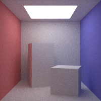

# FairPT
A fairly optimized cpu-only path tracer written in pure C++.



## Fairly Optimized

This implementation is by no means the fastest path tracer out there. It mainly serves an educational purpose. Nevertheless some effort was made to reduce the rendering time. In the following we list the optimization technics.

- ### Iterative Ray Casting
  Most path tracers are implemented in a recursive fashion, i.e. one creates a primary ray, cast it to the scene and immediately recurses on the scatter ray created from it. Alternative to this simple approach we first generate multiple primary rays and cast all of them towards the scene. Then all secondary rays are created and casted in the next iteration. 

- ### Bounding Volume Hierarchy (BVH)
  The bounding volume hierarchy is a well known acceleration structure. It is a rooted tree that organizes the primitives of a scene in such a way that a ray only needs to be casted to a subset of the primitives. The tree is constructed by recursively partitioning the set of primitives into k equally large subsets such that the variance of each subset is minimal. Thus each node of the tree is associated to a set of primitives. By casting a ray to the axis-aligned bounding box (AABB) that tightly contains all the primitives of a node, one can check if the ray misses the all the associated primitives. 
  
  In our implementation the tree has degree k = 4. This way a ray can be casted against all four children of a node simultaneously using SIMD instuctions.

- ### Ray Sorting
  Ray Sorting is an open research field with the target of efficiently grouping corherent rays together. Very different from that we use a simple approach to group rays. A ray is sorted into multiple buckets corresponding to leaf nodes of the BVH. Afterwards the buckets are flushed, i.e. all rays in a bucket are casted to the associated primitives. Note that we use an itertive procedure to ray casting which allows us to first sort all rays into buckets before going on. The main advantage from this is that rays are reordered in memory to achive memory coalescing for the casting routine.
  
- ### SIMD instructions (SSE4)
  We heavily use SIMD instructions to reduce the number of cpu instructions. The most straight forward way of using SIMD is to parallelize vector operations. A more involved way is to cast a ray to mulitple primitives simultaneously. Both are implemented in the casting routine.
  
- ### Multiprocessing
  The work of rendering an image is evenly distributed over all cpu-cores. This is done by splitting the full image into smaller chunks which can be processed in parallel. For simplicity we consider these chunks to be single pixels. Note that rendering only one pixel still requires multiple primary rays and thus the performance gain of iterative ray casting and ray sorting is still active. 


## Hello World
  
The API is designed to be easy to use. The following gives an practical overview on how to build and render a scene (from [`src/main.cpp`](src/main.cpp)).

Lets start by setting up a camera. This can be done as follows:
```C++
// set camera
Camera cam(
  Vec3f(0.5, 0.5, 1.35),  // origin
  Vec3f(0, 0, -1),        // view-direction
  Vec3f(0, 1, 0)          // up-direction
);
cam.fov(40.0f);             // set field of view in degrees
cam.vp_dist(1.35f + 1e-3f); // set viewport distance
```

Now that we have a camera ready, we can begin to create objects for the camera to see. But before that we need to define some materials. The path tracer supports a number of materials including `Lambertian`, `Dielectric`, `Metallic` and `Light` (see [`src/material.hpp`](src/material.hpp) for more information).
```C++
// create all materials
mtl::Material* light = new mtl::Light(new txr::Constant(Vec3f::ones * 3.0f));
mtl::Material* red = new mtl::Lambertian(new txr::Constant(Vec3f(0.25f, 0.25f, 0.75f)));
mtl::Material* blue = new mtl::Lambertian(new txr::Constant(Vec3f(0.75f, 0.25f, 0.25f)));
mtl::Material* white = new mtl::Lambertian(new txr::Constant(Vec3f(0.75f, 0.75f, 0.75f)));
mtl::Material* glass = new mtl::Dielectric(new txr::Constant(Vec3f(1.0f, 1.0f, 1.0f)), 1.5f);
mtl::Material* mirror = new mtl::Metallic(new txr::Constant(Vec3f(1.0f, 1.0f, 1.0f)), 0.0f);
```

Next we can actually create objects that are to be rendered. In genreal these objects are simple primitives (e.g. triangles, shperes). These are orgenized into a so called `BoundableList` (primitives need to be boundable for the BVH construction, thus `BoundableList`). The `Mesh` class also holds some helper functionality to easily create complex scenes from triangles only.
```C++
// create cornell box mesh
// a mesh is a collection of triangles
Mesh cornell = Mesh::CornellBox(white, red, blue, light);
// add two boxes to the scene
cornell.extend(Mesh::Parallelepiped(
  Vec3f(0.25, 0, -0.5), Vec3f(0.15, 0, -0.8), Vec3f(0.55, 0, -0.6), Vec3f(0.25, 0.6, -0.5), white));
cornell.extend(Mesh::Parallelepiped(
  Vec3f(0.8, 0, -0.15), Vec3f(0.5, 0, -0.25), Vec3f(0.9, 0, -0.45), Vec3f(0.8, 0.3, -0.15), white));

// the mesh class also supports simple .obj files
cornell.extend(
    Mesh::load_obj("obj/suzanne.obj", white)
    .fit_box(
        Vec3f(0.1f, 0.1f, -0.4f),
        Vec3f(0.9f, 0.9f, -1.0f)
    )
    .scale(20.0f)
); 

// add the triangles that build a mesh to a boundable list
// note that this is only neccessary if one wants to add
// primitives other than triangles to the scene
BoundableList objects;
objects.insert(objects.begin(), cornell.begin(), cornell.end());
// now that we are not working with a mesh anymore we can
// easily add spheres to the list
objects.push_back(new Sphere(Vec3f(0.7, 0.45, -0.3) * 20, 0.15 * 20, glass));
objects.push_back(new Sphere(Vec3f(0.3, 0.15, -0.3) * 20, 0.15 * 20, mirror));
```

Finally we can create and render the scene as follows:
```C++
// build scene and renderer
Scene scene(cornell);
Renderer renderer(scene, cam, 64, 10);
// render the scene
FrameBuffer fb(200, 200);
renderer.render(fb);
// save the framebuffer to a bmp file
fb.save_to_bmp("path/to/file.bmp")
```
